# Facebook Reach

## Contents
* [Introduction](#introduction)
* [Reach Types](#reach-types)
* [Techniques](#techniques)
	* [Personality](#personality)
	* [Hashtags](#hashtags)
		* [Example](#example)
	* [Call-to-Action](#call-to-action)
	* [Engagement](#engagement)
	* [Images](#images)
	* [Content Optimization](#content-optimization)
	* [Fine-Tuning](#fine-tuning)
	* [Videos](#videos)
	* [Reposts](#reposts)
	* [Tagging](#tagging)
	* [External Traffic](#external-traffic)
	* [Paid Advertising](#paid-advertising)
	* [Delayed Advertising](#delayed-advertising)
	* [Promotion](#promotion)
	* [Post Targeting](#post-targeting)
		* [Tutorial](#tutorial)
	* [Audience Insights](#audience-insights)
		* [Accessing](#accessing)
		* [Demographics](#demographics)
		* [Page Likes](#page-likes)
		* [Location](#location)
		* [Activity](#activity)
	* [Page Insights](#page-insights)
		* [Overview](#overview)
		* [Likes](#likes)
		* [Reach](#reach)
		* [Page Views](#page-views)
		* [Posts](#posts)
		* [Videos](#videos-1)
		* [People](#people)
* [Conclusion](#conclusion)
* [Further Reading](#further-reading)
	* [Original](#original)
	* [Revised](#revised)
* [Disclaimer](#disclaimer)

---

## Introduction
Recently, I was asked to do some research regarding Social Media, and how to expand the reach of the official Facebook fan page at Response Services Incorporated. I will admit that I was a little hesitant at first. This is because in my personal opinion, the social media and advertising industries can be quite shady. Even though I cannot compare Response to an organization such as Buzzfeed, it is still something I am wary of in principle. However, I later realized that optimizing the reach of a social media page is not that different from optimizing a web page for search engine rankings. I had no moral hesitation in researching [Search Engine Optimization](https://github.com/tjohnston-softdev/rsi-seo-tips) previously, so I was a little more comfortable with doing social media research now.

Through a quick Google search, I was able to shortlist several fairly recent articles which explain how one may increase the overall reach of their Facebook page. The catch is that as generalized as these sources are, they are still targeted towards large businesses and/or clickbait distributors. Seeing as Response is *neither* of those things, it is apparent that not all of this information applies to us. As a regional business, Response's Facebook page would be quite simple to maintain in comparison to worldwide brands such as McDonalds. What this report sets out to do is summarize the practices recommended by the articles into a single result.

---

## Reach Types
Before I can explain the different techniques, I need to point out the distinction between different forms of reach. You might think that the exact type of reach does not matter as long as it yields results, but some articles do make distinction between different forms of reach. In order to explain the theory behind these articles, I have decided to do the same.

>Facebook reach is the number of unique people who see your content on the social network. It’s a measurement of your brand’s effective audience. Not all of your fans will see every single post you publish. And not everyone who sees your updates will be fans of your Page
>
>\- Jennifer Beese (Sprout Social)

As for the different types of reach, the aforementioned article uses the following categories:

* **Organic** represents the number of people who saw the content on the news feed naturally without it being shared by anybody.
* **Paid** represents the number of people who saw the content as the result of a paid advertisement.
* **Viral** represents the number of people who saw the content due to it being liked, shared, etc.

---

## Techniques
The rest of this report is going to summarize the different techniques that I have found for expanding Facebook reach. The techniques that I have chosen to discuss are common between most of the articles I read. Since this is a summary, I will not reference the exact source for each piece of information unless it is a direct quotation. Instead, the sources will be listed at the end of this report for further reading.

---

### Personality
Simply put, nobody likes a boring brand. If an online presence can be likened to a stage performance, it is best to make it as entertaining as possible. It may be difficult to balance this against a professional image but things do not always have to be serious. There are many ways to go about this but the idea is to incorporate fun, quirky, and light-hearted content.

For example, you could post a picture of one of our day programs for disability clients, such as our video game group. It could even be as simple as showing a couple of friends together going about their day. Both of these ideas aim to depict the fun side of things and may entice interest in our services.

---

### Hashtags
When people hear the word "hashtag", they often think of Twitter. The use of hashtags has since expanded to other social media platforms. Facebook, Instagram, and Tumblr are examples of platforms that have functional support for hashtags. As a result, it may be necessary to use them in order to increase reach.

>A hashtag is a label for content. It helps others who are interested in a certain topic, quickly find content on that same topic. [...] Anyone sharing content on a relevant topic can add the hashtag label to their message.  Others searching for that topic, can search for that label to find other messages on that same social media platform.
>
>\- Anita Campbell (Small Business Trends)

\
To add a hashtag to your post, type the **#** symbol before adding the relevant keyword (#example)

---

#### Example
\

\
Imagine I run a Facebook page and I decide to post this Cat picture. If I chose to use hashtags, I would use ones like #cat, #adorable, #meow, or similar keywords. The tags should relate to the post content.

The tricky part about using hashtags in my opinion is moderation. Keep in mind that hashtags in social media were popularized by Twitter, so it is arguable that other platforms have 'copied' Twitter's hashtag mechanic.  I can understand how hashtags can be used to categorize posts and drive traffic but using any more than a few hashtags on a post can be seen as obnoxious. This means that users will ignore the content, or perhaps unlike the page entirely.

If I were running a social media page and felt the need to use hashtags, I would only use up to three per post...

\
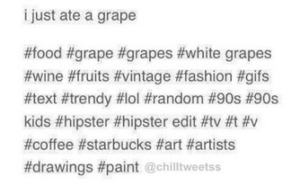
\
...but *this* is too much, even if it is meant to be a parody.

---

### Call-to-Action
The Call-to-Action is a marketing tactic which directly addresses the viewer as they read the content. This is seen as a great way to engage that viewer with your post and entice them to share it among their friends. A CTA in a Facebook post might be something such as:

* Like this post if you love Pizza.
* Do you enjoy our quality of service? Why not share it with your friends :)
* Do you prefer Red or Blue? Tell us in the comments section below.

In comparison to hashtags, the CTA is subjective. There are no right or wrong ways to write this sort of content. It is not a tangible 'feature' that can 'belong' to any particular platform. However, also like hashtags, they should be used in moderation. The Social Media Examiner points out that not every single piece of content needs to have a CTA. Rather, you should include a mix of different content with CTAs only being one part of the rotation. An occasional CTA post can promote engagement and interactivity among a fanbase. However, doing them too often in a short space of time can be seen as bad practice similar to using too many hashtags. If you do feel the need to include a CTA, it should be kept simple and not too obtrusive.

---

### Engagement
CTAs can be used in order to ask questions to your followers.

>Asking questions to your followers activates them, leading to greater reach for your Page. At the same time, it gives you the answers to questions that may be crucial for your company’s sales and marketing.
>
>\- Robert Rydefalk (Meltwater)

When you ask the users a question, the goal is to start a discussion. Furthermore, participating in this discussion yourself reassures your followers that they are heard. You do not have to answer *every* single question or reply to *every* single response, but the important part is the interaction between viewers and providers. The idea is to show them that as an organization, you are active, approachable and sensitive to their concerns. In return, users will be more likely to remain loyal fans and recommend it to their friends. Taking every opportunity to engage your audience is part of what keeps them coming back for more.

It may also help to acknowledge shared posts. In other words, if a particular fan or business shares one of your posts, you should ‘like’ it so that they know you appreciate their effort.

---

### Images
A picture is worth a thousand words. It is often much quicker to find a decent image and upload it to Facebook, rather than type out a wall of text. While images will not always replace text information, it is hard to deny that they can be more likely to capture the user's attention.

>We are very visual creatures. A large percentage of the human brain dedicates itself to visual processing. Our love of images lies with our cognition and ability to pay attention. Images are able to grab our attention easily, we are immediately drawn to them.
>
> \-James Balm (BioMed Central)

To reiterate, I am not suggesting that images replace text. You are able to include a short text description with an image post. Instead of relying solely on a long passage of text, you may upload a relevant image with a short description to establish context. It is a lot easier and quicker for the provider while more exciting and engaging for the user. Using a short description alongside the image is also a fair compromise for users who actively prefer text as opposed to images.

\
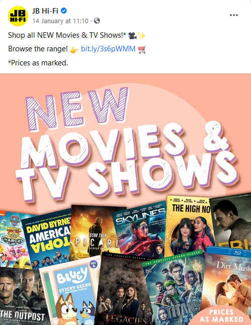

\
This sales promotion post from JB Hi-Fi includes both an image and a short text description.

---

### Content Optimization
When expanding the reach of a Facebook page, a good starting point would be posting content optimized to generate attention and reactions. I do not mean that this should be done artificially or that we should inflate numbers for the sake of it. I am referring to organic optimization. As people skim down their news feed, your content has to capture the user’s attention so that they stop and read. The promise of the content and what is being delivered should inspire and motivate people to react to, engage and share it.

>You should never publish content just for the sake of updating your Timeline — this applies to any social network, not only Facebook. Instead you should focus on creating content that fulfils your business objectives. The updates you post need to add value in some way, whether they’re educational, entertaining or conversational.
>
> \-Praneeta (Digible)

The Facebook news feed is seldom an exhaustive list of the recent content shared by those you are connected to. Rather, the posts that you will see upon refreshing the homepage are prioritized in such a way to maximize your potential engagement. Trying to describe this system in detail would warrant a report of its own and even here, there is no way to list all of the possible factors.

Some of the most important factors include:

* When was the post published?
* The number of likes, shares, comments, etc
* Are other people currently engaging with the post?
* How often has the user interacted with the page?
* How often has the user interacted with this type of post (text, image, etc) compared to others?

To describe the end result of this system:

>The Facebook news feed algorithms reward active advertisers and engaging content. The more reactions, comments, and shares your posts get, the better their reach. This goes for both organic and paid (your advertising dollars will go further).
>
> \-Mari Smith (Social Media Examiner)

In summary, the more reactions a post has, the more likely it will receive a high priority when loading one’s news feed. The best way to ensure that, of course, is to post content that captivates attention and entices a reaction.

---

### Fine-Tuning
When optimizing content, it is worth fine-tuning the length, timing, and frequency of posts. This may be an ongoing process of trial and error but the effort can be important in maximizing the long-term organic reach of a page. The Facebook Insights tool may be beneficial in this process, which will be discussed later on.

As for post length, not everybody prefers long or short posts. Some might prefer short while others prefer long. Regardless if the content is text, images, or videos, consider the interaction trends to determine the post length that the audience generally prefers.

As for when to post, try to concentrate around less busy times when people are more likely to be on Facebook. Of course, this is different per person. While I personally recommend the early-evening, that does not mean everybody will be active at the same time. However, once you find the time slot in which the audience is most receptive, post during that region so that people are more likely to see and react to content.

As for post frequency, the only thing I can say is to not post too often. Otherwise, people will start ignoring or unliking. For a regional business such as Response, I would think that posting once or twice a day on average is reasonable.

---

### Videos
If you are going to post videos, do so directly via Facebook where possible. It may be tempting to upload the video to YouTube and share the link but according to the articles I have read, videos uploaded directly to Facebook tend to have 10x more reach in comparison to those hosted on YouTube. It is understandable that you might be concerned about data limitations and internet speeds. Many people prefer to use YouTube as a central upload and share the link to multiple places throughout the internet. If you *are* connected to a network that will allow you to do so, upload the videos to Facebook directly. The News Feed Algorithm takes into account the video length as well as the reactions that it generates. Therefore, you can use video to gain more visibility and reach.

\
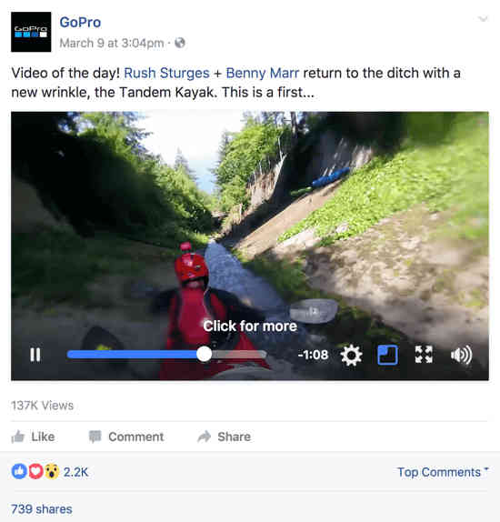

---

### Reposts
Sometimes when you need to communicate something important to a fanbase, it needs to be posted more than once. Try to identify this important content and after the initial post has expired, make another, similar post for those who may not have seen the first one.

If you choose to do this, try to post it at a different time in comparison to the original post. For example, you make a promotional post one day at 12pm. People might see it when they check their Facebook but consider that people have school, work, and other commitments. Not everybody checks in at the exact same time. Instead, you might repost the content at 7pm the following evening for example. Not everybody will be active within the same general time-frame. There may be a different crowd of people who check Facebook in the evenings and not on their lunch break.

Something else to keep in mind is that it is a bad idea to directly repost the content as it appeared originally. Instead, you should try to *reiterate* the content and explain the same information in a different way.

For example, consider that Bill Gates made a post to his Facebook page on the 21st of August 2017. While that post clearly had a good run of its own, he made a follow-up post the next day with similar content for those who may not have seen the first.

\
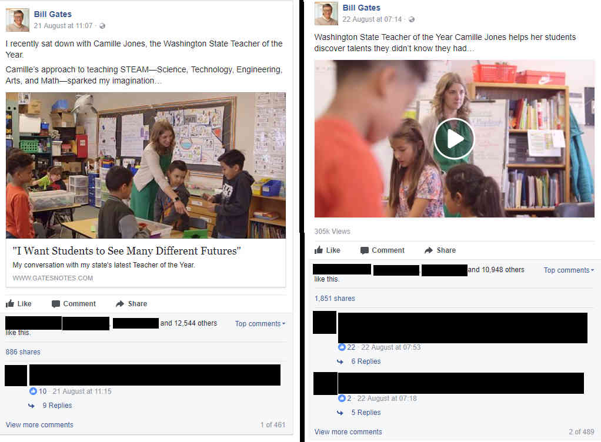

\
Also notice how that the original post is an image while the follow-up post is a video.

---

### Tagging
When you are referring to another brand in your Facebook content, it is recommended that you ‘tag’ or 'mention' the brand in question if they have a page of their own. This other brand could refer to another business, organization, cause, famous person, or anything else. Depending on their settings, the post may appear on that brand's page. This will likely draw attention from the fan bases of both brands. Hence, the reach potential for a post will be increased.

To tag something in a post, use the **@** symbol before typing the name. A list of matching names will be displayed as you type. You can select the name from the match list in order to tag them.

\
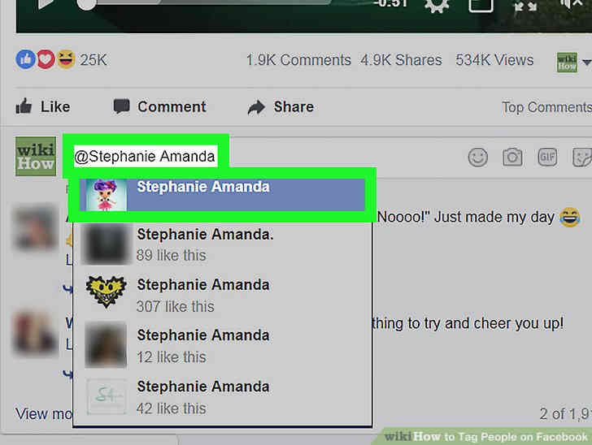

\
On the final post, the tagged name will look and function similar to a hyperlink. When somebody clicks on the [tagged name](#tagging), they will be taken to the corresponding page.

---

### External Traffic
To give a simple description, if you embed or link a post in a website outside of Facebook, you will help send and direct people to the original source of the content. Therefore, you can improve your reach by accounting for those who might not have seen the content, or even use Facebook at all. Furthermore, there are plug-ins and widgets that enable you to embed Facebook posts, videos, or even entire pages onto a website so that users may view the Facebook content externally. You can also embed a simple ‘like button’ widget along with something that links to the page itself. However, the implementation of these widgets will not be discussed in this report.

---

### Paid Advertising
This is exactly what it sounds like. You can pay for Facebook to advertise your content and boost the potential reach. As a result, Facebook’s algorithms will amplify both your organic and paid content.

>Here’s where you start to pay to boost the reach of your content to improve your Facebook marketing ROI considerably. Rather than promote everything, apply some strategic selection to amplify the established organic reach of specific posts with Facebook ads.
>
>For some posts, your objective may be to raise awareness and increase engagement and video views, for example. But for other posts, you’ll want to promote those with a link so you can drive traffic to your website. 
>[...]
>After you **select your posts, decide how you want to allocate your budget**. For the best results, spread out your ad spend and avoid blowing your entire budget on a single post with one boost or one ad.
>
>\-Mari Smith (Social Media Examiner)

---

### Delayed Advertising
Relating back to the different forms of reach, posts can either gain reactions organically or with the assistance of paid advertising. Rather than simply relying on one or the other, it is recommended that you do not pay for advertising as soon as a post is made. Instead, let the post circulate naturally for a given amount of time before you boost it with an advertisement. How long that delay should be is subjective. For example, a post made by a global business with several million likes will have their posts circulated in a matter of minutes, or even seconds. However, for a smaller, more local business, this could be up to 24 hours.

---

### Promotion
Despite Facebook’s popularity as a marketing tool, not everything you post has to be promotional or sales-related. Even though a business can have a Facebook page, the articles that I have read point to the concept of the 80/20 rule. In other words, only 20% of posts should be directly promotional while the other 80% should be more informal. For example, you could make a post regarding the general experience at Response on most days. Then you might make a blatant promotion perhaps once or twice a week.

---

### Post Targeting
Instead of relying on paid advertising as the first resort, posts can be targeted to specific audiences. The Facebook News Feed algorithm will take these targets into account so that the particular post will reach the right people organically. A post can be targeted towards demographics such as gender, age, location, and specific interests. You can also set an expiry date for your post so it will stop showing on news feeds by that date. With that being said, this feature only affects the likelihood of a post being displayed on a given person’s news feed. Of course, when somebody views a fan page directly, they can see all of their posts, even if they passed their 'expiry date'. It is also important to note that when using this feature, your post must target at least 20 people.

---

#### Tutorial
First, make sure that 'Audience Optimization for Posts' is enabled in your page settings.

\
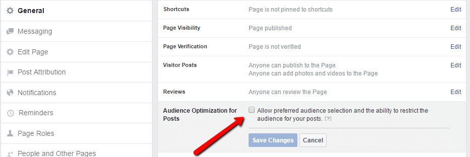

\
\
\
To use the post targeting feature, follow the screenshots below.

\
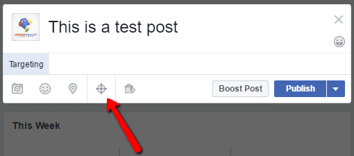

\
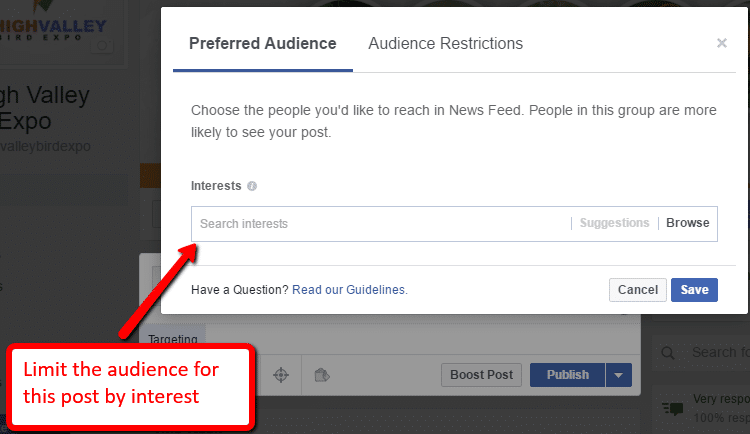

\
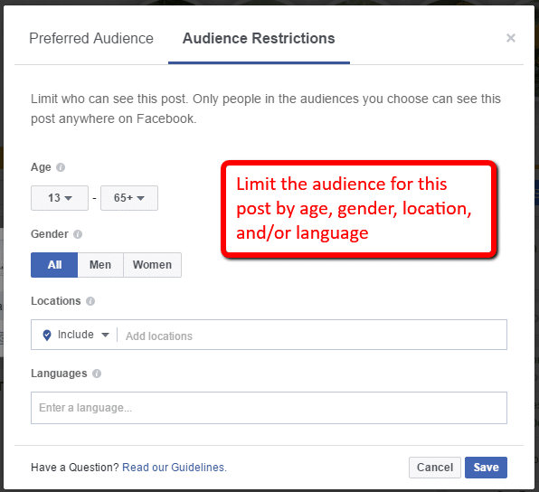

\
\
When using post targeting for the first time, you may want to test it out by running a couple of targeted posts using different criteria. This is so you can gauge the audience reaction per post and see if it makes a difference.

---

### Audience Insights
As posts can be targeted towards specific audiences either through organic reach or paid advertising, Facebook offers an 'Audience Insights' feature. This is where page managers can view statistics and demographics about their audience as a whole.

The insights tool divides statistics into three categories:

* Facebook in general. Everyone who sees your content regardless of their reaction.
* People who are directly connected to the page. Those who have ‘liked’ it.
* Saved custom audiences for different demographics, interests, usage habits and other variables.

---

#### Accessing
In order to access the 'Audience Insights' tool, you must open the 'Facebook Ad Manager'. It is found within the dropdown menu under the "Analyse and Report" section.

\
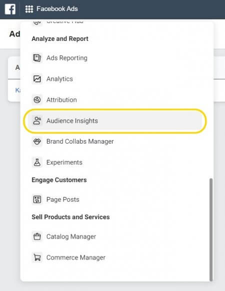

\
\
You will then see a pop-up allowing you to choose the desired audience. Alternatively, you can close it and view the entire dashboard.

\
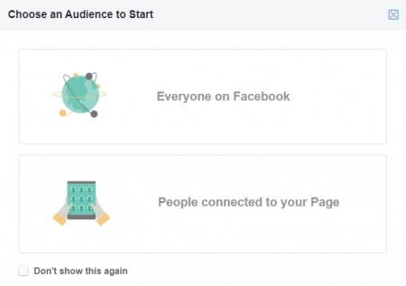

---

#### Demographics
The 'Demographics' tab allows you to narrow down your target audience by adjusting different filters. These filters include location, age, gender, interests, and liked pages. As you modify these filters, the graphs will automatically update to display the new results. Different tabs will show different graphs and data depending on the chosen filters.

\
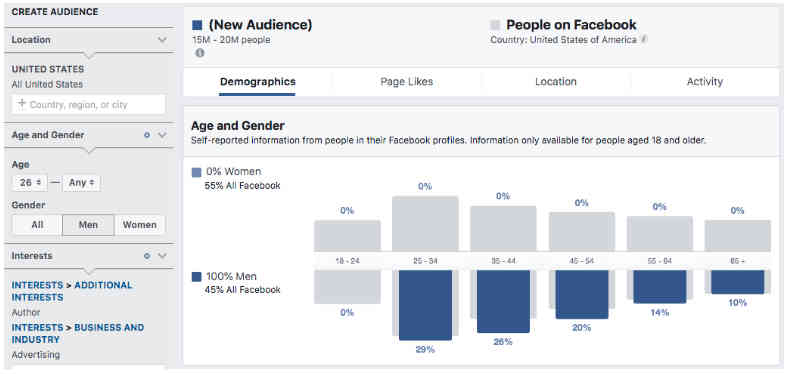

\
\
For example, you can filter to display information about people who are interested in 'Coffeehouses'

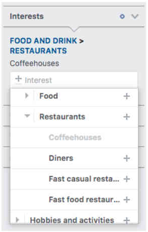

---

#### Page Likes
The ‘Page Likes’ tab shows top categories related to the audiences and in turn, the fan pages related to that audience behaviour. This tab shows audience data that can help indicate which pages have more engagement in comparison to others.

>Notice that this table shows different data like audience and affinity, which is used to identify which fanpages have more engagement than others. This information is used by advertisers to know which competitors have better marketing strategies and engagement with their audiences. While big fanpages show low affinity rates because of the huge amount of fans, which doesn’t mean low engagement, you can actually see difference in the affinity rate between smaller fanpages.
>
> \-Maryam Sicard (Stream SEO)

\
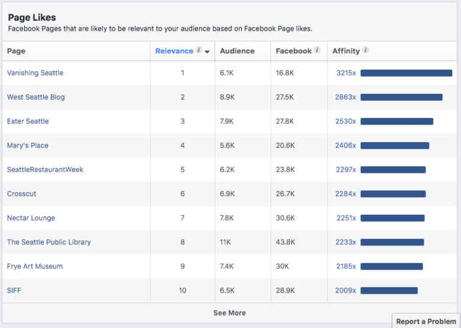

---

#### Location
The 'Location' tab shows information regarding the most common cities, countries, and languages related to the current filtered audience.

\
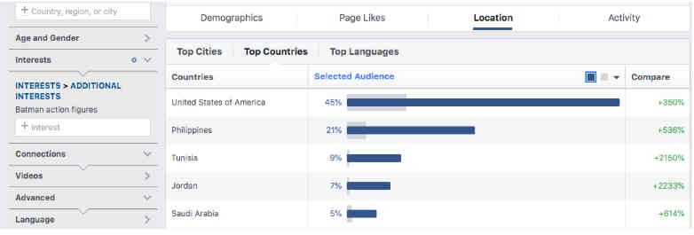

---

#### Activity
The 'Activity' tab shows the frequency of activities among audience members. These activities include liking pages, liking posts, making comments, sharing content, and clicking advertisements. It will also show how the audience accesses Facebook per device and which device is the most common.

\
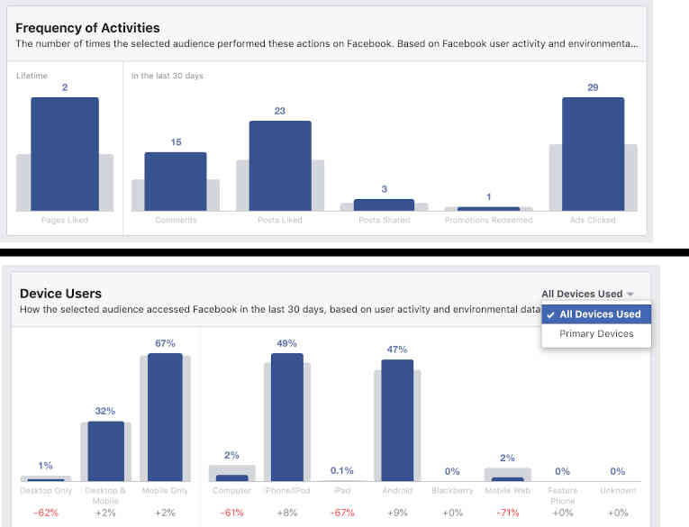

---

### Page Insights
While ‘Audience Insights’ can be used to help gain demographic data regarding your page audience, the ‘Page Insights’ tool is used to obtain engagement statistics about the fan page itself. Rather than focusing on the audience. It focuses on providing data that indicates how the page is performing. As the 'Audience Insights' tool was covered previously, not much new information needs to be displayed here. While it is used a little differently for different purposes, the general idea remains the same.

You can access the ‘Page Insights’ tool by accessing your page while logged in as an administrator. Afterwards, click ‘Insights’ at the top of the page.

\
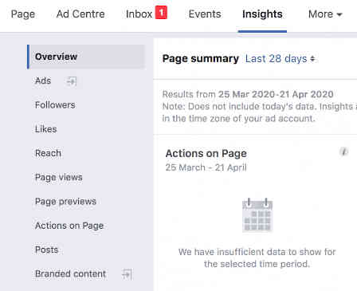

\
As you can see on the left sidebar, the insights are divided into many different sections. Each of them go into detail about a specific area. This report will only elaborate on the most important sections.

---

#### Overview
The 'Overview' section dashboard displays general information about the page's performance within a given time-frame.

\
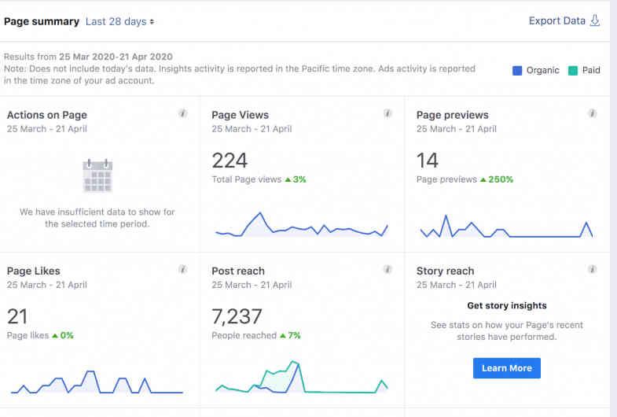

---

#### Likes
The 'Likes' section displays statistics related to page likes. These include the number of likes or unlikes for any given day, whether the likes were organic or paid, and how many per individual source.

\
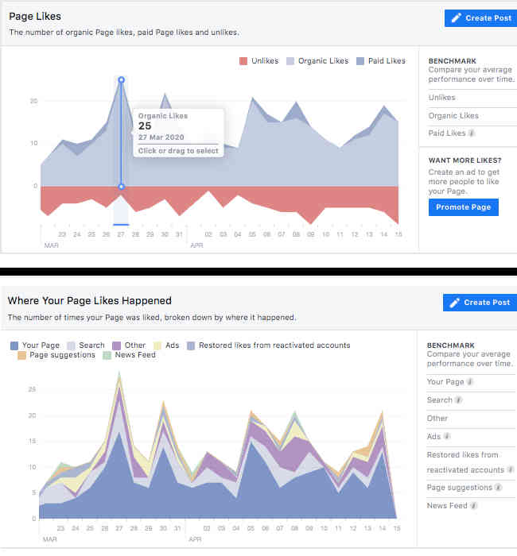

---

#### Reach
The 'Reach' section shows data regarding the overall engagement of fans. This includes:

* Post reach
	* The number of people that the page content has reached.
	* Broken down by organic circulation or paid advertisement.
* Positive engagement
	* Likes, comments, shares, etc.
* Negative engagement
	* Hides, Spam reports, unlikes, etc.
* Total reach
	* The total number of people who have seen any of the page's posts regardless of how they have been circulated.

\
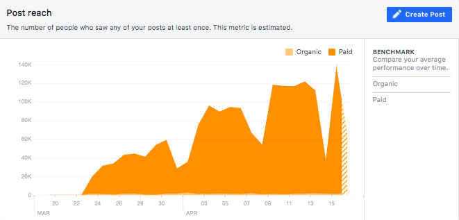

---

#### Page Views
The 'Page Views' section show data regarding the number of times the page has been viewed. It will also display the number of times people were directed to the page via an outside source such as the organization's website.

\
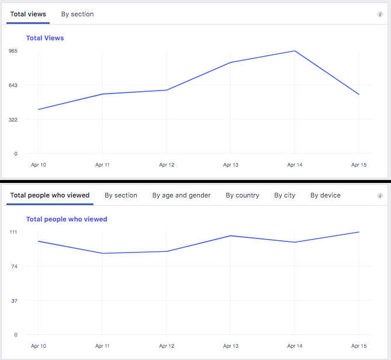

---

#### Posts
The 'Posts' section shows information regarding the engagement across different posts. This includes:

* The most frequent days and times that fans are active.
* The engagement and reach across different post types.
* Most popular posts across the entire page.
* Reach and engagement for individual posts.

\
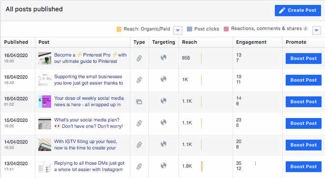

---

#### Videos
The 'Video' section displays information related to video posts. This includes:

* **Overall views:** The number of times videos posted on the page were viewed for at least three seconds.
* **10-Second Views:** Number of times videos posted on the page were viewed for at least 10 seconds.
* **Top videos:** Most viewed videos based on the number of 3+ second views.

Since this is similar to the 'Posts' section, I have decided not to include a screenshot.

---

#### People
The 'People' section displays information about the number of people who have interacted with the page in some way. This includes:

* Total number of likes
* Total number of people reached.
* Total number of people who have actively engaged.

\

For example, this screenshot indicates that out of all of the depicted page's fans, 57% of them are women, 41% are men, and the remaining 2% presumebly have a different gender identity. The column graph shows that the most popular gender-age demographic is women aged 45 to 54.

---

## Conclusion
This report is a compilation of several different sources regarding Facebook fan pages and advice on how they can be managed. It also explains how to promote the page for potential new fans, and to promote engagement among existing fans. It should be noted that this is not qualified or concrete information on running Facebook page, or any website for that matter. Hence, it should only be used as a starting point. Below, I have included links to the source material and other used assets for further reading.

-Tyrone

---

## Further Reading

Here is a list of all of the sources used when writing this document. They are separated by whether they were used originally (5-6 September 2017), or when revising for public release (1-3 February 2021).

---

### Original

* [How to Boost Facebook Reach](https://www.meltwater.com/en/blog/10-easy-ways-to-expand-your-facebook-reach?redirect-path=%2Fau%2Fblog%2F10-easy-ways-to-expand-your-facebook-reach)  
\-Robert Rydefalk (Meltwater)

* [How to Maximize Your Facebook Reach](https://www.socialmediaexaminer.com/how-to-maximize-facebook-reach/)  
\-Mari Smith (Social Media Examiner)

* [20 Secrets to Boost Your Facebook Organic Reach](https://neilpatel.com/blog/13-secrets-thatll-boost-your-facebook-organic-reach/)  
\-Neil Patel

* [How to Easily Increase Your Facebook Reach](https://web.archive.org/web/20170710040633/https://sproutsocial.com/insights/facebook-reach/)  
\-Jennifer Beese (Sprout Social)

* [How to Use Facebook Audience Insights to Increase ROI](https://stream-seo.com/facebook-audience-insights/)  
\-Maryam Sicard (Stream SEO)

* [What Can I Learn From Facebook Page Insights?](https://tinuiti.com/blog/paid-social/facebook-page-insights/)  
\-Tara Johnson (Tinuiti)

* [A Beginner’s Guide to Facebook Analytics and Insights](https://web.archive.org/web/20170130181224/https://blog.hootsuite.com/facebook-analytics-insights-beginners-guide/)  
\-Dara Fontein (Hootsuite)

* [What is a Hashtag? And What Do You Do With Hashtags?](https://smallbiztrends.com/2013/08/what-is-a-hashtag.html)
\-Anita Campbell (Small Business Trends)

* [Too Many Hashtags Can Be a Bad Practice](https://www.customfitonline.com/news/2014/9/5/too-many-hashtags-bad-practice/)  
\-Roy McClean (Custom Fit Online)

* [New To Hashtags? 7 Things You Should Know](https://www.hashtags.org/how-to/etiquette-how-to/new-to-hashtags-7-things-you-should-know/)  
\-Tom Durby (hashtags.org)

* [The Power of Pictures](https://blogs.biomedcentral.com/bmcblog/2014/08/11/the-power-of-pictures-how-we-can-use-images-to-promote-and-communicate-science/)  
\-James Balm (BioMed Central)

* [Facebook Ads Guide - Image](https://www.facebook.com/business/ads-guide/image/facebook-feed/post-engagement)  
\-Facebook

* [Facebook goes Twitter](https://web.archive.org/web/20170401003446/https://www.geek.com/consumer/facebook-goes-twitter-rolls-the-tags-in-posts-and-statuses-899031/)  
\-Christian Zibreg (Geek.com)

* [6 Tips for Increasing Facebook Organic Reach in an Age of Decline](https://www.toprankblog.com/2016/08/increase-facebook-organic-reach/)  
\-Caitlin Burgess (Top Rank Marketing)  

* [4 Ways to Increase Facebook Organic Reach](https://www.digible.in/id/33/testing-blog/)  
\-Praneeta

* Oficial Facebook fan page - Camille Jones interview ([post 1](https://www.facebook.com/BillGates/posts/10154830454241961), [post 2](https://www.facebook.com/watch/?v=10154832450706961))  
\-Bill Gates

* [Facebook for Business - Audience Insights](https://web.archive.org/web/20170528005510/https://www.facebook.com/business/news/audience-insights)  
\-Facebook

* [Facebook IQ - Audience Insights](https://www.facebook.com/business/insights/tools/audience-insights?ref=ens_rdr)  
\-Facebook

* [Facebook Audience Insights And Why You Need To Use It](https://web.archive.org/web/20171017000640/https://glossmarketing.com.au/social-media/facebook-audience-insights-why-you-need-to-use-it)  
\-Megan Del Borrello (Gloss Marketing)

* [Editing in Ads Manager](https://www.facebook.com/business/help/165119026899353?id=281239296137284)  
\-Facebook

* [Insights FAQ](https://www.facebook.com/help/794890670645072)  
\-Facebook

---

### Revised

* [How to improve your Facebook reach in 2020](https://sproutsocial.com/insights/facebook-reach/)  
\-Phil Grossman (Sprout Social)

* [How to Tag People on Facebook](https://www.wikihow.com/Tag-People-on-Facebook)  
\-wikiHow Staff (wikiHow)

* [How To Use Facebook Preferred Audience Targeting For Organic Posts](https://fanbooster.com/blog/facebook-audience-targeting-organic-posts/)  
\-Andrew Kunesh (Fanbooster)

* [How To Reach New Audiences with Facebook Audience Insights](https://napoleoncat.com/blog/facebook-audience-insights/)  
\-Kasia Slonawska (NapoleonCat)

* [Cat stock photo](https://pixabay.com/photos/cat-pet-domestic-cat-mackerel-4348355/)  
\-Nennieinszweidrei (Pixabay)

* [5 Ways to use Facebook Audience Insights](https://revealbot.com/blog/facebook-audience-insights/)  
\-Reggie Paquette (Revealbot)

* [How to Use Facebook Audience Insights for Precise Ad Targeting](https://blog.hootsuite.com/facebook-audience-insights/)  
\-Todd Clarke (Hootsuite)

* [Page Insights dashboard screencap](https://mgnsw.org.au/sector/resources/online-resources/digital/facebook-evaluation/)  
\-Musuems & Galleries of NSW

* [The Beginner’s Guide to Facebook Analytics](https://blog.hootsuite.com/facebook-analytics-insights-beginners-guide/)  
\-Christina Newberry (Hootsuite)

* [Official Facebook fan page - New Movies & TV Shows sale](https://www.facebook.com/JBHiFi/posts/4055090247857043)  
\-JB Hi-Fi

---

## Disclaimer
This repository is based on an internal document I wrote as part of the IT team at Response Services Incorporated. I was asked to conduct some research on how to improve the reach of their Facebook fan page, and compile the results into a document for future reference.

I wrote the original version of this document on 5-6 September 2017. While this information appears to still be relevant as of 2021, there is no guarantee that it is accurate or up-to-date.

The document was converted to markdown on 1-3 Feburary 2021. Any organization-specific information was removed, rewritten to fit with the general topic, or elaborated upon with context. The revised document was then shared publicly to GitHub on 3 Feburary 2021.

The sources I have used - both for the original document, and when revising for public release - have been linked in the [Further Reading](#further-reading) section with the name of the author. All links have been verified as of 3 Feburary 2021. The information I used for this document is the property of its respective legal owners.

The screencaps of [Bill Gates'](https://www.facebook.com/BillGates) Facebook fan page are my own work and were made on September 6 2017.

The screencap of the [JB Hi-Fi](https://www.facebook.com/JBHiFi) sales promotion post on their Facebook fan page is my own work and was made on 2 Feburary 2021.

The [Cat](https://pixabay.com/photos/cat-pet-domestic-cat-mackerel-4348355/) image file was retrieved from Pixabay on 1 Feburary 2021, which is freely [licensed](https://pixabay.com/service/license/) for both personal and commercial use. I used a different Cat image when writing the original document. However, it was from a commercial source so I replaced it with a 'Creative Commons' image.

All other images originate from the source articles linked in 'Further Reading'

Minor edits were performed on different images using [GIMP](https://www.gimp.org/) for file size reduction, cropping, and joining similar images together.

This document as a whole is licensed under [CC BY-NC-ND 4.0](https://creativecommons.org/licenses/by-nc-nd/4.0/).

